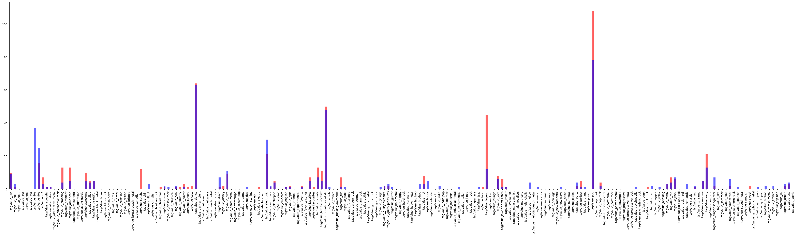

# Contextual Bandits



## Dependencies

```sh
python -m pip install sklearn numpy pandas
```
## Experimentation

Process wikipedia data to create a `Udf.csv` file.

```py
python wiki_text.py
```

Update the global variables to modify experiment parameters.

```py
use_wiki_data = True
use_only_wiki_data = True
center_data = False
binarize_tags = False
svd_tags = True
svd_tags_components = 100

# Top k artists
k = 1500
# J experiments
J = 150
# H trials
H = 35
```

```sh
python linearucb_experiment.py
```

Then analyze the results using the result analysis script.

```py
python results_analysis.py
```

## Outomes
### (Newer code)

```sh
use_wiki_data False
use_only_wiki_data False
svd_tags True
center_data False
svd_tags_components 50
binarize_tags False
control: 0.02 | reward: 0.23 | lift: 0.21000000000000002

use_wiki_data False
use_only_wiki_data False
svd_tags True
center_data False
svd_tags_components 3
binarize_tags True
control: 0.02 | reward: 0.16 | lift: 0.14

use_wiki_data False
use_only_wiki_data False
svd_tags True
center_data False
svd_tags_components 30
binarize_tags False
control: 0.02 | reward: 0.2 | lift: 0.18000000000000002

use_wiki_data False
use_only_wiki_data False
svd_tags True
center_data False
svd_tags_components 100
binarize_tags False
control: 0.02 | reward: 0.19 | lift: 0.17

use_wiki_data False
use_only_wiki_data False
svd_tags True
center_data False
svd_tags_components 3
binarize_tags False
control: 0.02 | reward: 0.19 | lift: 0.17

```